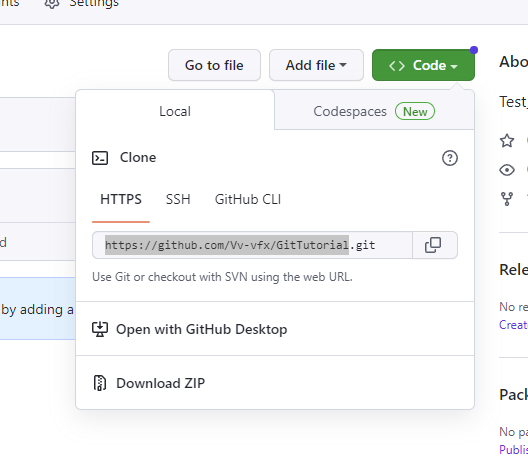

# Туториал по работе с Git

## Начало работы

Для начала работы, необходимо инициализировать сам Git

Для его инициализации введите команду 

```
  git init
```

## Добавление файла

Для добавления файла в Git необходимо воспользоваться командой 

```
git add название файла
```

# Как работать с чужим репо

## Клонирование удаленного репозитория на локалку
Открываем репозиторий и кликаем Fork. Получаем форк чужого репозитория в своём аккаунте

## Клонирование удаленного репозитория на локалку

Теперь клонируем наш удаленный репозиторий к себе на локалку

```
git clone ссылка на репозитрий
```
ссылку берем здесь:



## Создаем новую ветку

```
git switch -c имяВетки
```
ссылку берем здесь:


## Вносим изменения и коммитим


```
git add имя_файла
git commit -m "..."
git status
```

## Пушим изменения на удаленный репо


```
git push
```